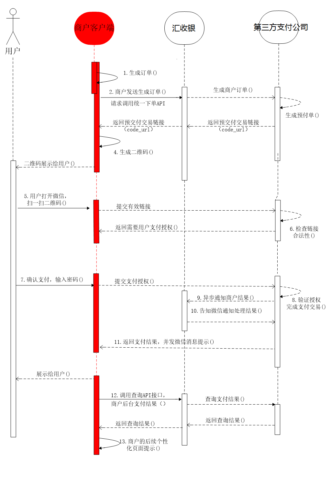
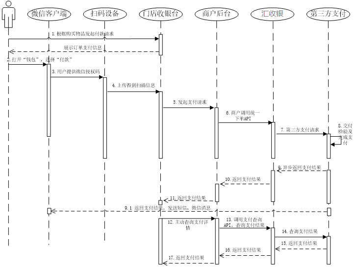

## 主扫

案例

线上：微信，支付宝。

线下：待补充。

- 场景介绍
 - 微信
 ```text
步骤1：商户根据第三方支付的规则，为不同的商品生成不同的二维码，展示在各种场景，用于用户扫描购买。
步骤2：用户使用第三方支付“扫一扫”，扫描二维码后，获取商品支付信息，引导用户完成支付。
步骤3：用户确认支付，输入支付密码
步骤4：支付完成后会提示用户支付成功，商户后台得到支付成功的通知，进行后续处理，如发货。
```
 - 支付宝
 ```text
步骤1：商户根据支付宝的支付规则，为不同的商品生成不同的二维码，展示在各种场景，用于用户扫描购买。
步骤2：用户使用支付宝“扫一扫”，扫描二维码后，获取商品支付信息，引导用户完成支付。
步骤3：用户确认支付，输入支付密码，支付完成后会提示用户支付成功，商户后台得到支付成功的通知，进行后续处理，如发货。
 ```

  - 时序图
  


  - 业务流程说明

1.商户后台系统根据用户选购的商品生成订单。

2.用户确认支付后调用汇收银 【统一下单API】生成预支付交易；

3.汇收银收到请求后生成预支付交易单，并返回交易会话的二维码链接code_url。

4.商户后台系统根据返回的code_url生成二维码。

5.用户打开微信“扫一扫”扫描二维码，微信客户端将扫码内容发送到微信支付系统。

6.微信支付系统收到客户端请求，验证链接有效性后发起用户支付，要求用户授权。

7.用户在微信客户端输入密码，确认支付后，微信客户端提交授权。

8.微信支付系统根据用户授权完成支付交易。

9.微信支付系统完成支付交易后给汇收银返回交易结果，并将交易结果通过短信、微信消息提示用户。微信客户端展示支付交易结果页面。


## 被扫

案例

线上：微信，支付宝。

线下：待补充。

- 场景介绍
 - 微信

   以下的截图以微信作为第三方为例。
 ```text
步骤1：商户根据第三方支付的规则，生成订单及支付信息（如图3.1）；
步骤2：用户点开微信“钱包”点击“付款”（如图3.2）；
步骤3：用户将“付款码”界面对准商户扫描设备，完成支付（若未开启免密情况，需要用户输入密码完成支付）；
步骤4：支付完成后会提示用户支付成功，商户后台得到支付成功的通知；
```
 - 支付宝
 ```text
步骤1：商户根据支付宝的支付规则，生成订单及支付信息；
步骤2：用户点开支付宝点击“付款”（如图3.1）；
步骤3：用户将“付款码”界面对准商户扫描设备，完成支付；
步骤4：支付完成后会提示用户支付成功，商户后台得到支付成功的通知,用户也会得到支付成功的消息（如图3.2）；
 ```

 - 时序图
 


 ## 场景介绍